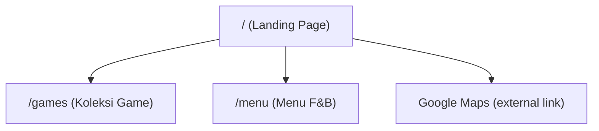

# PRD — Gatherloop Board Game Cafe Landing Page

| | |
|---|---|
| **Status** | Draft |
| **Author** | Gatherloop Team |
| **Last updated** | 2026-07-14 |
| **Target platform** | Web (static site, deployed on GitHub Pages) |
| **Language** | Bahasa Indonesia (all customer-facing content) |

---

## 1. Background

Gatherloop is a board game cafe located in Kraksaan, Probolinggo. Customers currently
have no single place to find essential information: how much it costs to play, what
games are available, what food & drinks are served, and where the cafe is located.

This project delivers a simple, mobile-first landing page (link-tree style) that
answers those questions in one scroll, plus two supporting pages (Game Collection and
F&B Menu).

## 2. Goals

1. Give potential customers all key information (harga main, koleksi game, menu, lokasi) in one place.
2. Be easily shareable as a single URL on Instagram bio, WhatsApp, and Google Maps profile.
3. Be cheap to host and easy to maintain — static site on GitHub Pages, content editable by non-developers where possible (JSON data file, replaceable images).

### Non-Goals (out of scope for v1)

- Online reservation / booking system
- Online ordering or payment
- CMS or admin dashboard
- User accounts
- Multi-language support (Indonesian only)

## 3. Target Users

- **Walk-in prospects** (mobile, 80%+ of traffic expected): found Gatherloop via Instagram or Google Maps, want to know price, games, and location before visiting.
- **Existing customers**: want to check the game collection or menu before/while visiting.

Primary device: **smartphone**. The design must be mobile-first; desktop is a nice-to-have that reuses the same centered single-column layout.

## 4. Site Map



| Route | Page | Description |
|---|---|---|
| `/` | Landing | Hero, Harga Main, link items, FAQ, footer |
| `/games` | Koleksi Game | List of board games from a static JSON data file |
| `/menu` | Menu F&B | Displays the existing menu image(s) |
| _external_ | Lokasi | Direct link to the Google Maps pin (opens in new tab) |

## 5. Functional Requirements

### 5.1 Landing Page (`/`)

Single-column, link-tree style page with five sections, in order:

#### A. Hero

- Full-width hero image (cafe interior / people playing board games). Placeholder image until the real photo is ready.
- Gatherloop logo.
- Tagline in Indonesian, e.g.:
  > **"Tempat Nongkrong Seru Sambil Main Board Game"**
  >
  > Ratusan pilihan game, kopi enak, dan teman baru menunggumu di Gatherloop.
- (Copy is placeholder — final wording to be confirmed by the owner.)

#### B. Harga Main (Play Rate)

- Section title: **"Harga Main"**.
- The rate is communicated with an **image** (poster/infographic produced by the team). The page only provides the layout slot; use a placeholder image for now.
- Image requirements:
  - Displayed at full content width (max ~480px on desktop), maintains aspect ratio.
  - Must have descriptive `alt` text (e.g. "Daftar harga main Gatherloop") for accessibility and for when the image fails to load.
  - Image file lives in the repo (e.g. `public/images/harga-main.png`) so the owner can update it by replacing the file.

#### C. Info Links (link-tree style)

Three large, tappable card/button links stacked vertically:

| Label (ID) | Destination | Behavior |
|---|---|---|
| 🎲 **Koleksi Game** | `/games` | Internal navigation |
| ☕ **Menu Makanan & Minuman** | `/menu` | Internal navigation |
| 📍 **Lokasi** | Google Maps URL | Opens in new tab (`target="_blank"`, `rel="noopener"`) |

- Below the **Lokasi** link (or as its subtitle), show the address description:
  > **Perum New Kraksaan Land, Blok G16, Kebonagung, Kraksaan**
- Minimum tap target height 48px; full content width.

#### D. FAQ (accordion)

- Section title: **"Pertanyaan yang Sering Ditanyakan"** (or "FAQ").
- Accordion behavior: tapping a question expands its answer; tapping again collapses it. Multiple items may be open at once (simplest behavior; no exclusive-open requirement).
- Must work with keyboard (Enter/Space) and expose proper `aria-expanded` state. Prefer native `<details>/<summary>` for zero-JS robustness.
- Initial FAQ content (placeholder, to be confirmed by owner):

| Pertanyaan | Jawaban (draft) |
|---|---|
| Apakah harus reservasi dulu sebelum datang? | Tidak perlu, kamu bisa langsung datang. Untuk rombongan besar, hubungi kami dulu via Instagram/WhatsApp. |
| Berapa harga untuk main board game? | Lihat bagian "Harga Main" di atas ya. Harga sudah termasuk akses ke semua koleksi game. |
| Apakah ada yang mengajari cara bermain? | Ada! Tim kami siap menjelaskan aturan game yang kamu pilih. |
| Jam operasionalnya kapan? | Setiap hari, silakan cek Instagram kami untuk jam operasional terbaru. |
| Apakah boleh datang sendirian? | Boleh banget! Kamu bisa gabung bermain dengan pengunjung lain. |

- FAQ content stored as a static data file (JSON) or inline content — implementation detail, but must be easy to edit.

#### E. Footer

- Social media icons + links (open in new tab): Instagram, WhatsApp, TikTok (final list to be confirmed; Instagram is mandatory).
- Short address line (same as Lokasi description) and copyright: `© 2026 Gatherloop`.

### 5.2 Game Collection Page (`/games`)

- Page title: **"Koleksi Game"**, with a back link to `/`.
- Renders a list/grid of games (1 column on mobile, 2–3 columns on wider screens).
- Each game card shows:
  - **Image** (box art) — placeholder allowed initially
  - **Title**
  - **Duration range** — e.g. "30–60 menit"
  - **Player count range** — e.g. "2–5 pemain"
  - **Age range** — e.g. "8+"
- **Data source: static JSON file** in the repo (`src/data/games.json`). JSON is chosen over markdown because the data is structured/tabular (numbers, ranges) and JSON can be imported/validated at build time without a frontmatter parsing step.

```jsonc
// src/data/games.json — schema
[
  {
    "title": "Splendor",
    "image": "/images/games/splendor.jpg", // path in public/, placeholder allowed
    "minDurationMinutes": 30,
    "maxDurationMinutes": 60,
    "minPlayers": 2,
    "maxPlayers": 4,
    "minAge": 10
  }
]
```

- Display rules:
  - Duration: `"{min}–{max} menit"`; if min == max, show single value (`"30 menit"`).
  - Players: `"{min}–{max} pemain"`; if min == max, `"{min} pemain"`.
  - Age: `"{minAge}+"`.
- v1 has **no search/filter/sort** (collection is small). If the collection grows, a client-side name filter can be added later (future enhancement).

### 5.3 Menu F&B Page (`/menu`)

- Page title: **"Menu Makanan & Minuman"**, with a back link to `/`.
- Shows the existing menu image(s) at full content width. Support **one or more** images stacked vertically (menus often span multiple pages).
- Image files live in `public/images/menu/` — the owner updates the menu by replacing files.
- Each image needs `alt` text ("Menu makanan dan minuman Gatherloop — halaman 1").
- Placeholder image until the real menu image is added to the repo.

### 5.4 Location

- No dedicated page. The "Lokasi" link points directly to the Google Maps pin URL (to be provided by owner; use a placeholder `https://maps.app.goo.gl/...` constant until then).
- The address description **"Perum New Kraksaan Land, Blok G16, Kebonagung, Kraksaan"** appears in two places: under the Lokasi link and in the footer.

## 6. Non-Functional Requirements

| Area | Requirement |
|---|---|
| Hosting | GitHub Pages, deployed automatically from `main` via GitHub Actions |
| Performance | Static output, minimal JS. Images lazy-loaded below the fold, compressed (WebP preferred). Target Lighthouse ≥ 90 on mobile for Performance/SEO/Accessibility |
| SEO | Indonesian meta title/description, Open Graph tags (for WhatsApp/Instagram link previews), favicon, `sitemap.xml` |
| Accessibility | Semantic HTML, alt text on all images, keyboard-operable accordion, sufficient color contrast |
| Responsiveness | Mobile-first (360px baseline); single centered column, max-width ~640px content on desktop |
| Browser support | Evergreen browsers + Android WebView (Instagram in-app browser) |
| Base path | Site must work under a GitHub Pages subpath (`https://<org>.github.io/<repo>/`) **and** a custom domain later — all internal URLs must respect the configured base path |

## 7. Tech Stack (proposed)

- **[Astro](https://astro.build/)** static site generator.
  - Rationale: zero JS by default (fast on low-end phones), file-based routing for the 3 pages, components for shared header/footer, first-class JSON import for the games data, official GitHub Pages deploy action, and `base` config handles the Pages subpath problem.
  - Alternative considered: plain HTML/CSS/JS (no build). Rejected because header/footer/layout would be copy-pasted across pages and the games list would need client-side fetch + rendering, which is worse for SEO and slow devices.
- **Plain CSS** (single stylesheet with CSS custom properties for theme tokens). No CSS framework needed at this size; can revisit if the site grows.
- **No client-side framework.** The FAQ accordion uses native `<details>/<summary>`.
- **GitHub Actions** workflow using `withastro/action` to build and deploy to GitHub Pages.

## 8. Visual Direction & Mockups

Visual tone: warm, playful, cozy ("tempat nongkrong"). Suggested tokens (to refine during implementation):

- Background: warm cream `#FAF6F0`
- Primary/accent: deep green `#1F6F54` (buttons, links)
- Text: near-black `#26221D`
- Rounded corners (12–16px), soft shadows on cards.
- Font: a friendly sans-serif (e.g. system stack or a single Google Font such as "Nunito" self-hosted to avoid external requests).

### 8.1 Landing page — mobile (primary)

```
┌─────────────────────────────┐
│ ╔═════════════════════════╗ │
│ ║                         ║ │
│ ║      [ HERO IMAGE ]     ║ │
│ ║   people playing games  ║ │
│ ║                         ║ │
│ ╚═════════════════════════╝ │
│         (o) Gatherloop      │
│                             │
│   Tempat Nongkrong Seru     │
│   Sambil Main Board Game    │
│   Ratusan pilihan game,     │
│   kopi enak, dan teman baru │
│                             │
│  ── Harga Main ──────────── │
│ ┌─────────────────────────┐ │
│ │                         │ │
│ │  [ HARGA MAIN IMAGE ]   │ │
│ │  (poster/infographic)   │ │
│ │                         │ │
│ └─────────────────────────┘ │
│                             │
│ ┌─────────────────────────┐ │
│ │ 🎲  Koleksi Game      › │ │
│ └─────────────────────────┘ │
│ ┌─────────────────────────┐ │
│ │ ☕  Menu Makanan       › │ │
│ │     & Minuman           │ │
│ └─────────────────────────┘ │
│ ┌─────────────────────────┐ │
│ │ 📍  Lokasi            ↗ │ │
│ │     Perum New Kraksaan  │ │
│ │     Land, Blok G16,     │ │
│ │     Kebonagung, Kraksaan│ │
│ └─────────────────────────┘ │
│                             │
│  ── FAQ ─────────────────── │
│ ┌─────────────────────────┐ │
│ │ Apakah harus reservasi  │ │
│ │ dulu sebelum datang?  ▾ │ │
│ ├─────────────────────────┤ │
│ │ Berapa harga untuk      │ │
│ │ main board game?      ▾ │ │
│ ├─────────────────────────┤ │
│ │ Apakah ada yang         │ │
│ │ mengajari cara main?  ▴ │ │
│ │ ┈┈┈┈┈┈┈┈┈┈┈┈┈┈┈┈┈┈┈┈┈┈┈ │ │
│ │ Ada! Tim kami siap      │ │
│ │ menjelaskan aturan game │ │
│ │ yang kamu pilih.        │ │
│ └─────────────────────────┘ │
│                             │
│ ───────── footer ────────── │
│      [IG]  [WA]  [TikTok]   │
│   Perum New Kraksaan Land,  │
│   Blok G16, Kebonagung,     │
│   Kraksaan                  │
│      © 2026 Gatherloop      │
└─────────────────────────────┘
```

### 8.2 Landing page — desktop

Same single centered column, max-width ~640px, generous whitespace on the sides;
hero image may widen to ~960px with rounded corners.

```
┌───────────────────────────────────────────────────────────┐
│                ┌───────────────────────────┐              │
│                │       [ HERO IMAGE ]      │              │
│                └───────────────────────────┘              │
│                       (o) Gatherloop                      │
│            Tempat Nongkrong Seru Sambil Main              │
│                       Board Game                          │
│                                                           │
│                     ── Harga Main ──                      │
│                ┌─────────────────────┐                    │
│                │ [HARGA MAIN IMAGE]  │                    │
│                └─────────────────────┘                    │
│                ┌─────────────────────┐                    │
│                │ 🎲 Koleksi Game   › │                    │
│                └─────────────────────┘                    │
│                        ... etc ...                        │
└───────────────────────────────────────────────────────────┘
```

### 8.3 Koleksi Game page — mobile

```
┌─────────────────────────────┐
│ ‹ Kembali                   │
│                             │
│      Koleksi Game           │
│                             │
│ ┌─────────────────────────┐ │
│ │ ┌───────┐  Splendor     │ │
│ │ │ box   │  ⏱ 30–60 menit│ │
│ │ │ art   │  👥 2–4 pemain│ │
│ │ └───────┘  🎂 10+       │ │
│ └─────────────────────────┘ │
│ ┌─────────────────────────┐ │
│ │ ┌───────┐  Uno          │ │
│ │ │ box   │  ⏱ 15–30 menit│ │
│ │ │ art   │  👥 2–10 pemain│ │
│ │ └───────┘  🎂 7+        │ │
│ └─────────────────────────┘ │
│           ...               │
└─────────────────────────────┘
```

### 8.4 Menu F&B page — mobile

```
┌─────────────────────────────┐
│ ‹ Kembali                   │
│                             │
│  Menu Makanan & Minuman     │
│                             │
│ ┌─────────────────────────┐ │
│ │                         │ │
│ │   [ MENU IMAGE PG 1 ]   │ │
│ │                         │ │
│ └─────────────────────────┘ │
│ ┌─────────────────────────┐ │
│ │   [ MENU IMAGE PG 2 ]   │ │
│ └─────────────────────────┘ │
└─────────────────────────────┘
```

## 9. Implementation Phases

Each phase is one small, independently reviewable PR. Every PR leaves the deployed
site in a working (if incomplete) state. Suggested order below; phases 4–7 are
independent of each other and can be parallelized after phase 3.

### Phase 1 — Project scaffolding & GitHub Pages deployment
**PR: `chore: scaffold Astro project and GitHub Pages deploy`**
- Initialize Astro project (minimal template), `.gitignore`, `README.md` with local dev instructions (`npm install`, `npm run dev`).
- Configure `site` and `base` in `astro.config.mjs` for GitHub Pages.
- GitHub Actions workflow (`.github/workflows/deploy.yml`) building and deploying to Pages on push to `main`.
- A bare `/` page with just "Gatherloop" text to prove the pipeline.
- **Done when:** pushing to `main` publishes the placeholder page on the GitHub Pages URL.

### Phase 2 — Base layout, design tokens & footer
**PR: `feat: base layout, global styles, and footer with social links`**
- Shared `Layout.astro`: HTML head (Indonesian `lang="id"`, meta title/description, Open Graph tags, favicon), global CSS with color/typography tokens from §8.
- `Footer.astro`: social media icons (placeholder URLs as named constants), address line, copyright.
- Landing page uses the layout (content still mostly empty).
- **Done when:** all future pages can compose `Layout` + `Footer`; footer matches mockup.

### Phase 3 — Landing: Hero & Harga Main sections
**PR: `feat: landing hero and harga main sections`**
- Hero section: hero placeholder image, logo, tagline copy (§5.1.A).
- "Harga Main" section with the placeholder rate image slot (§5.1.B).
- Responsive per mockups 8.1/8.2.
- **Done when:** landing shows hero + harga main matching the mockup on mobile and desktop.

### Phase 4 — Landing: info link items
**PR: `feat: landing link-tree section (Koleksi Game, Menu, Lokasi)`**
- Three link cards (§5.1.C). `/games` and `/menu` may 404 until phases 6–7 — acceptable, or link cards can be marked "segera hadir" until then (reviewer's choice; prefer shipping the real hrefs).
- Lokasi card links to Google Maps placeholder URL, shows the address description, opens in a new tab.
- **Done when:** three cards render and navigate correctly.

### Phase 5 — Landing: FAQ accordion
**PR: `feat: landing FAQ accordion`**
- FAQ section using `<details>/<summary>` with the draft Q&A content (§5.1.D), styled per mockup.
- FAQ entries defined in a single easy-to-edit data structure (JSON file or const array).
- **Done when:** items expand/collapse via tap and keyboard; content matches §5.1.D.

### Phase 6 — Game Collection page
**PR: `feat: game collection page backed by games.json`**
- `src/data/games.json` with the schema from §5.2, seeded with 5–10 real games (placeholder box-art images).
- `/games` page rendering the card grid with title, image, duration, players, age, and back link.
- Formatting rules from §5.2 (range collapsing, "menit"/"pemain"/"N+").
- **Done when:** adding a game = adding one JSON entry + one image file, no code change.

### Phase 7 — Menu F&B page
**PR: `feat: menu F&B page`**
- `/menu` page rendering one or more menu images from `public/images/menu/` with back link (§5.3).
- Placeholder image until the real menu image is provided.
- **Done when:** replacing the image file(s) updates the menu with no code change.

### Phase 8 — Content & launch polish
**PR: `chore: real content, SEO polish, and launch checklist`**
- Swap placeholders that are ready: real hero photo, harga main image, menu images, Google Maps URL, social media URLs, final tagline & FAQ copy (owner input needed — see §10).
- `sitemap.xml`, verify OG previews on WhatsApp, Lighthouse pass (≥90 mobile), image compression to WebP.
- Optional: custom domain setup (CNAME) if the owner has one.
- **Done when:** launch checklist in the PR description is fully checked.

## 10. Open Questions (owner input needed)

1. Final Google Maps pin URL for the Lokasi link.
2. Social media accounts to include (Instagram handle, WhatsApp number, TikTok?).
3. Final tagline wording and FAQ answers (drafts in §5.1 are placeholders).
4. Hero photo, harga main poster image, and menu image files.
5. Will a custom domain be used, or the default `github.io` URL?
6. Operating hours — show them on the landing page or keep pointing to Instagram?

## 11. Future Enhancements (post-v1 backlog)

- Search/filter on the game collection (by player count, duration).
- Game detail page with description and rules-summary link.
- Reservation via WhatsApp deep link with pre-filled message.
- Event/komunitas section (game nights, tournaments).
- Google Analytics or a lightweight privacy-friendly counter.
